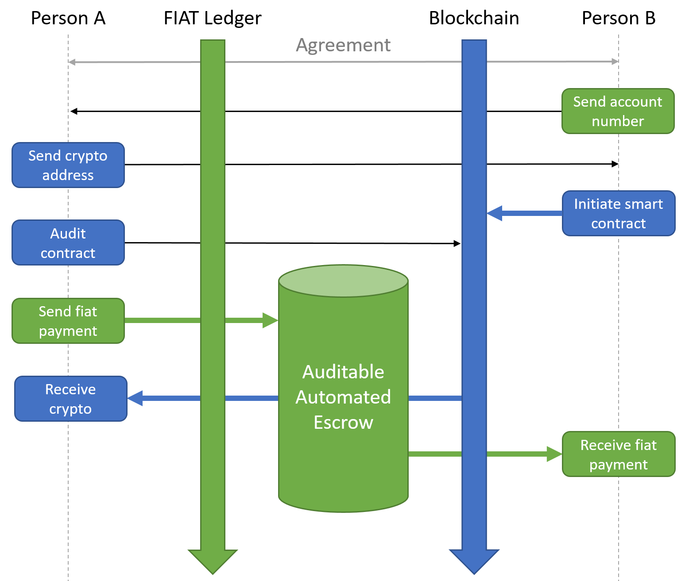

# molecularswap
Peer-to-peer exchange between fiat money and cryptocurrencies.

A molecular swap is a decentralized way of exchanging cryptocurrencies to fiat. For example, one party would send DCR to a second party's Decred address, while the second party would send EUR to the first party's bank account. Since fiat currencies do not support smart contracts, there will be an auditable and fully automated escrow involved in the trade. Because this exchange is more complex than a regular atomic swap, we call this process a molecular swap.

Molecular swaps require each party to initiate a transaction. The person transacting crypto pays into a smart contract, while the person who is transacting fiat pays to an Auditable and Automated Escrow (AAE). In order for the molecular swap to start, both parties need to agree on the transacted amount and the exchange rate. This is essential for the success of the swap.

The AAE consists of three elements. 1) A bank account number known to the community, which is registered solely for the purpose of receiving and sending money. 2) A public database that logs the incoming and outgoing transactions. 3) An auditable server with a script that converts incoming transactions into new payments, based on information in their reference.

The image below provides a visual of the steps each party performs:

## Example swap
Alice wants to buy Decred. She enters into an agreement with Bob. They both agree to exchange 10 DCR for 720 EUR. Alice receives Bob’s bank account number and sends Bob her DCR address. 

Bob starts by sending 10 DCR into a smart contract. It is linked to the DCR address of Alice and contains a unique key. The funds in the contract are locked and can only be redeemed by Alice if she sends her payment to the AAE. When a certain period of time expires after the contract was mined, but not redeemed by Alice, the funds inside the contract will automatically be transferred back to Bob’s wallet. The smart contract monitors the AAE database for the incoming payment of Alice. The smart contract is initiated with two parameters: the bank account of Bob and an amount in euros (720 in this example) to be paid.

Alice then audits the smart contract of Bob. She checks that Bob sent 10 DCR, and obtains the unique key that she will use in her transaction to the AAE. In her transaction, she sends 720 EUR to the AAE, with in the reference two strings: the bank account number of Bob and the key that she obtained from the smart contract. 

When the payment of Alice passes, it shows up in the logs of the AAE database. The unique key that Alice included in the reference activates the smart contract of Bob (which has monitored the AAE database continuously), and the contract will audit the payment using the two parameters. If the amount >720 EUR and if Alice provided the correct bank account in the reference, the smart contract initiates an on-chain transaction of 10 DCR to the DCR address of Alice.

The script on the AAE server uses the unique key to validate that the smart contract initiated the transaction (using the API from dcrdata), to be sure that the contract did not expire. The script then uses the bank account number that Alice provided in the reference to generate a new payment. The transacted amount is the same as the AAE received (if Alice paid more, Bob receives more). In the case that the validation fails, the payment returns to sender.

If everything executed correctly, Alice now has 10 DCR and Bob has 720 EUR in his account. 

## Open questions
Since we are talking about a decentralized exchange service, anyone could potentially set up an AAE. The process of setting it up would be similar to that of setting up a stakepool. The code and requirements would be open-source and available to everyone who wants to contribute or audit. However, before we write code there are some questions to answer.

*What if Alice tries to revoke the payment after it showed up in the AAE database?*

*How can we make the AAE secure to prevent hackers from exploiting molecular swaps?*

*There may be legal and regulatory complications. What kind of complications?*
* Does an AAE need a legal entity? Business or non-profit/foundation? 
* Will an AAE need to be KYC/AML compliant?

*Keeping an AAE up and running is costly. What are its major expenses?*
* It needs to pay the monthly expenses of a public bank account.
* It needs to maintain a secure and publicly available database. 
* It needs to upkeep a secure (virtual) server running an auditable script.
* It needs to be independent and fully transparent about its operations. 

*How can the AAE make a profit?* 

Option 1. It could provide an order-matching website where people can submit requests for molecular swaps. 
* People could pay to create an account on this website.
* People could pay the AAE to list a swap request on the website.

Option 2. It could provide a platform to negotiate the molecular swap agreements.
* People could pay to create an account on this platform.
* People could pay the AAE if they start negotiating.
* People could pay the AAE if they come to an agreement.

Option 3. It could take a certain percentage in fees on the transactions that go through its bank account.

Option 4. It could fully rely on donations.
